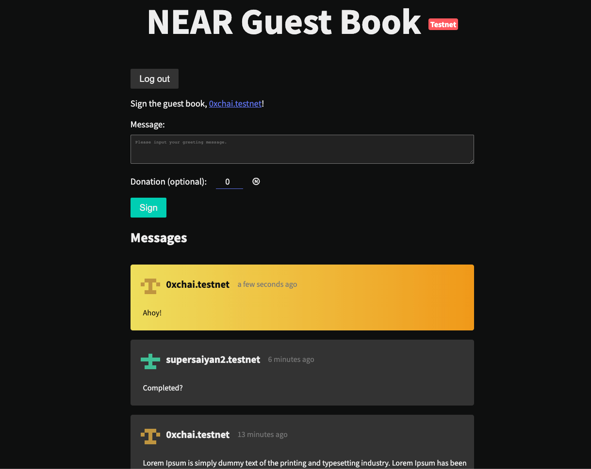

Guest Book
==========

- DEMO - https://nearspring-challenge4-guestbook.vercel.app/

---

Link: https://discord.com/channels/490367152054992913/963097203050709032/965635603188305920

## Challenge #4. Wallet Selector bounty:learning: 
This is a 2-step challenge where you will try to integrate Wallet Selector (near-wallet-selector) and showcase interaction with your modified Guest Book example.

#### Step 1.
Clone the repository for the Guest Book example. You can follow the instructions here: https://examples.near.org/guest-book
Modify the example to display the date and time someone signed it. Deploy the contract on a testnet sub-account. Add more modifications to the example, like changing the styling to make it your own. You can make it as simple or complex as you like! 

#### Step 2.
Integrate Wallet Selector with your modified example. Follow the instructions provided here: https://github.com/near/wallet-selector
Install the wallets you want to support. For this challenge, you should have NEAR Wallet (near-wallet) and Sender Wallet (sender) supported. Deploy your example (GitHub Pages is the most simple option) and showcase some interaction using the Sender option. Connect and sign the guest book, with and without attached NEAR (donation).

You can install Sender wallet as a browser extension using this link: https://senderwallet.io/
For Near Wallet to work with Wallet Selector properly you must upgrade near-api-js to version to 0.44.2
near-api-js version installed in dApp (guest book) must match with the near-api-js version in Wallet Selector

## Credit

- [wallet-selector](https://github.com/near/wallet-selector)
- [minidenticons](https://github.com/laurentpayot/minidenticons)
- [dayjs](https://day.js.org/)
- [Loading.io](https://loading.io/css/)